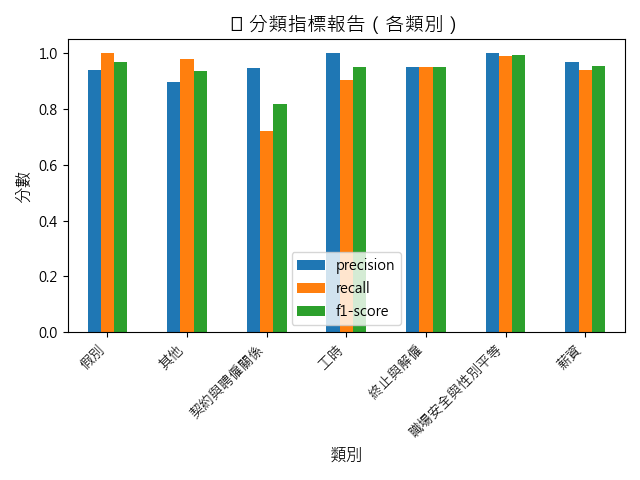

# 勞基法多類別文本分類（BERT 微調）

本專案旨在透過 BERT 模型對台灣勞基法相關條文進行多類別分類，達成基礎法律條文自動標註與後續 Chatbot 法規應答的前置任務。資料來自台灣勞動部公開規範，並經人工標註後完成模型微調。

---

## 📌 專案目標

- 使用預訓練 BERT 對勞基法條文進行多類別分類微調
- 輸出模型評估指標（Precision, Recall, F1）與視覺化結果
- 製作基本 Streamlit Demo 作為模型預測展示
- 模型將應用於 [AI Chatbot 專案](https://github.com/HUEI-JYUN-DEBBY-YEH/AI_Chatbot)

---

## 🗂️ 資料來源與前處理

- **原始來源**：台灣勞動部法規資料庫（勞基法、施行細則、相關函釋等）
- **前處理步驟**：
  - 將條文斷句為句子層級
  - 清理特殊符號與空白
  - 以人工標註標籤分類為多類別標籤（7類）

檔案結構：
```
data/
  ├── raw_laborlaw_txt/              # 勞基法原始資料（未上傳 GitHub）
  ├── laborlaw_sentences_labeled.csv # 已標註的句子資料
  ├── laborlaw_dataset.json          # 訓練用 JSON 格式
  ├── label2id.json                  # 類別對應表
```

---

## ⚙️ 模型訓練流程

- 使用 HuggingFace Transformers
- 模型架構：`bert-base-chinese`
- 搭配 PyTorch 進行訓練與驗證切分
- 自訂 Trainer，並產出分類報告

程式包含：
- `train_finetune_trainer.py`：訓練主程式
- `evaluate.py`：產出預測結果與分類報告
- `plot_metrics.py`：將分類結果繪圖輸出

---

## 📊 模型表現（分類指標）

F1-score 圖示：



詳細數值請參考：
- `classification_report.json`
- `laborlaw_predicted.csv`

---

## 🚀 快速啟動 Demo

```
pip install -r requirements.txt
streamlit run demo.py
```

打開瀏覽器前往： [http://localhost:8501](http://localhost:8501)

---

## 🔗 應用串接

本模型將作為基礎分類模組，嵌入進入 [AI Chatbot 法規應答模組](https://github.com/HUEI-JYUN-DEBBY-YEH/AI_Chatbot)，提供 Chatbot 對勞基法相關提問的快速分類與理解能力。

---

## ✅ TODO

- [ ] 模型上傳 HuggingFace Hub（或壓縮存放）
- [ ] 評估增強資料、自動標註擴充
- [ ] Chatbot 整合模組完成後回傳使用紀錄做 retrain

---

## 📜 License

本專案為個人學習與展示用途，如需商業應用請自行確認原始資料授權。